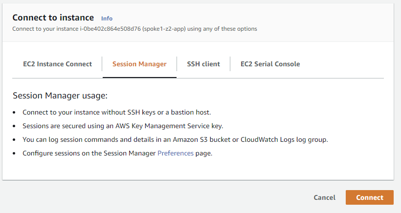
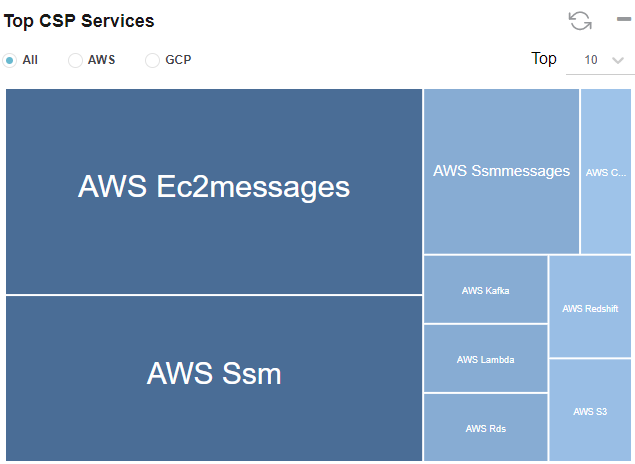

# Lab 1: Discover


In Lab 1, you will enable Valtix’s discovery features and be able to gather inventory and traffic information about your AWS account.

## Procedure

1. Ensure you have completed pre-requisites.
2. Log in to [Valtix Controller](https://prod1-dashboard.vtxsecurityservices.com/)
3. Navigate to **Easy Setup -> Cloud Account** on the left panel.
4. Click on AWS logo. This will take you to the onboarding page to link your AWS account to the Valtix Controller.
5. To onboard your AWS account, there is a 2 step process:
      * Deploy of CloudFormation template to create necessary IAM permission for Valtix Controller - step 6
      * Fill in the form in the onboarding screen to add account to Valtix Controller - step 10
6. Click on the CloudFormation link at the top of the page. This will open up another tab to deploy CloudFormation template in your AWS account. It may ask you to log in to your AWS account.
7. Select the checkbox "**I acknowledge that AWS CloudFormation might create IAM resources with custom names**", and then click **Create Stack**.
8. Wait for the CloudFormation stack to complete. This may take a few minutes.
9. Navigate back to the Valtix Controller tab. You should still be on the onboarding page where you clicked on CloudFormation template link.
10. Fill out the information to onboard AWS account on Valtix Controller. Most information is filled in already, below are 2 parameter participant would need to fill in. 

     Parameter | Description
     ---------|--------------
     AWS Account Number | AWS Account Number. This can be found in CloudFormation stack output.
     Account Name | Provide account name. This is used only in Valtix Controller to reference this AWS account.
     Controller IAM Role | This information is given in the CloudFormation stack output. Look at the value for `ValtixControllerRoleArn` in the output tab. 
     Inventory Monitor Role | This information is given in the CloudFormation stack output. Look at the value for `ValtixInventoryRoleArn` in the output tab. 

12. Click **Save & Continue**. You have successfully onboarded your account and Valtix Controller will discover your inventory.
13. Navigate to **Easy Setup -> Traffic Visibility**.
14. Fill out the information to enable Traffic Visibility.

     Parameter | Description
     ----------|-------------
     CSP Account | Select the CSP account that you just onboarded
     Region | Select a region to enable Traffic Visibility
     VPCs | Select VPCs to enable Traffic Visibility. This will enable DNS query log and VPC flow logs
     S3 Bucket | Input the S3 bucket name that you used in step 7.

15. Click **Save & Continue**

## Verification

1. Navigate to **Discovery -> Inventory -> Summary**. This page provides a list of cloud resources that was discovered by Valtix. On one page, we see everything in your account. 
2. Now generate traffic to see DNS and VPC information:

      *  Navigate to AWS console EC2 Service page and select spoke-z1-app instance.
      *  Click on "Connect" button at the top.
      *  Use Session Manager(SSM) to connect to your instance.
         
      *  Generate traffic to following website from the instance's Session Manager(SSM) console:

      ```
      curl http://www.google.com
      curl http://www.facebook.com
      sudo yum -y update &
      ```
    
4. Navigate to **Discovery -> Traffic -> DNS**. This provides a summary of the traffic that Valtix gathered from DNS query logs and correlates it with threat intelligence and your asset inventory. 
5. Click on **Logs**. You should see the traffic that you generated to Google and Facebook.  

6. Let's generate some traffic to AWS Cloud Services using AWS CLI

     *  Navigate back to spoke-z1-app instance from Session Manager(SSM).
     *  Generate traffic with the following AWS cli command:


    ```
    aws cli
    aws s3 ls
    aws cloudfront list-distributions
    aws --region us-east-1 lambda list-functions
    aws --region us-east-1 rds describe-account-attributes
    aws --region us-east-1 redshift describe-account-attributes
    aws --region us-east-1 kafka list-clusters
    ```

7. Navigate to **Discovery -> Traffic -> DNS**. 
8. Scroll down to the bottom of the page. Find "Top CSP Services" treemap. Valtix shows you information on what CSP Services your environment is using so you can build policies based on Cloud Services.

9. Let's generate some traffic to malicious sites.

     * Navigate back to spoke-z1-app instance from Session Manager(SSM).
     * Generate traffic by executing below cli command:

    ```
    wget --no-proxy --no-check-certificate  --post-data 'X5O!P%@AP[4\PZX54(P^)7CC)7}$EICAR-STANDARD-ANTIVIRUS-TEST-FILE!$H+H*' -O /tmp/av.log https://www.example.com
    wget -O /dev/null -o /dev/null http://mspy.com
    wget -O /dev/null -o /dev/null http://17ebook.com
    wget -O /dev/null -o /dev/null http://purplehoodie.com
    ```

10. Click on **Malicious Categories**. If Valtix detects traffic that could potentially be malicious, Valtix highlights those sessions for users. Navigate back to Summary. This provides a better view to see malicious activities.
11. The traffic generated to purplehoodie is a potential malicious site categorized by brightcloud. If you lookup purlehoodie.com in [brightcloud url-lookup](https://www.brightcloud.com/tools/url-ip-lookup.php), you'll realize that it's high risk.
12. Navigate to **Discovery -> Traffic -> VPC.** Valtix provides a summary based on VPC flow log and correlates it with threat intelligence and your asset inventory. 
13. Find **VPC Traffic** and **Instance Traffic** graphs. These graphs provides you with which VPC and Instance traffic distribution. You could potentially identify if any of your instances are being used as bots.
<br>
