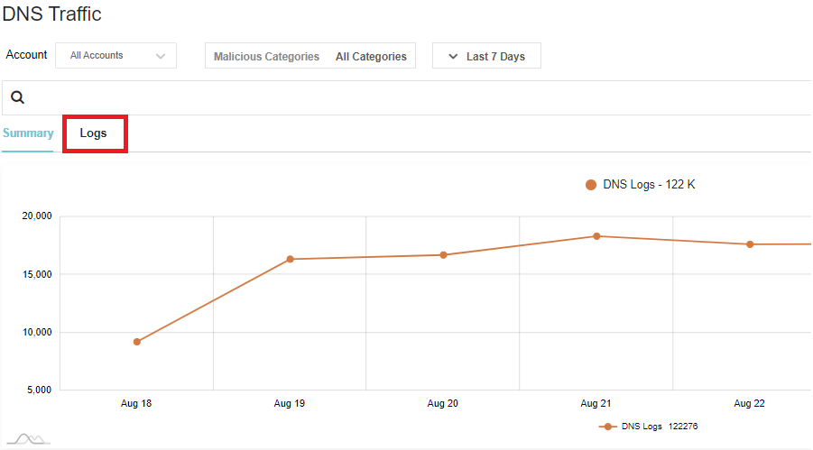

# Lab 1: Discover


In Lab 1, you will enable Valtix’s discovery features and be able to gather inventory and traffic information about your AWS account.

## Procedure

1. Ensure you have completed pre-requisites.
2. Log in to [Valtix Controller](https://prod1-dashboard.vtxsecurityservices.com/)
3. Navigate to **Easy Setup -> Cloud Account** on the left panel.
4. Click on AWS logo. This will take you to the onboarding page to link your AWS account to the Valtix Controller.
5. To onboard your AWS account, there is a 2 step process:
      * Deploy of CloudFormation template to create necessary IAM permission for Valtix Controller - step 6
      * Fill in the form in the onboarding screen to add account to Valtix Controller - step 11
6. Click on the CloudFormation link at the top of the page. This will open up another tab to deploy CloudFormation template in your AWS account. It may ask you to log in to your AWS account.
7. In the CloudFormation template, most of the mandatory fields have been auto-filled. Fill in the following parameters:

     Parameter | Description
     ----------|-------------
     S3 Bucket Name | Supply a unique **S3 bucket name**. This bucket name needs to be globally unique in AWS. See [bucket naming rules](https://docs.aws.amazon.com/AmazonS3/latest/userguide/bucketnamingrules.html)
 
8. Select the checkbox "**I acknowledge that AWS CloudFormation might create IAM resources with custom names**", and then click **Create Stack**.
9. Wait for the CloudFormation stack to complete. This may take a few minutes.
10. Navigate back to the Valtix Controller tab. You should still be on the onboarding page where you clicked on CloudFormation template link.
11. Fill out the information to onboard AWS account on Valtix Controller. Most information is filled in already, below are 2 parameter participant would need to fill in. 

     Parameter | Description
     ---------|--------------
     Account Name | Provide account name.
     Controller IAM role | This information is given in the CloudFormation stack output. Look at the value for `ValtixControllerRoleArn` in the output tab. 

12. Click **Save & Continue**. You have successfully onboarded your account and Valtix Controller will discover your inventory.
13. Navigate to **Easy Setup -> Traffic Visibility**.
14. Fill out the information to enable Traffic Visibility.

     Parameter | Description
     ----------|-------------
     CSP Account | Select the CSP account that you just onboarded
     Region | Select a region to enable Traffic Visibility
     VPCs | Select VPCs to enable Traffic Visibility. This will enable DNS query log and VPC flow logs
     S3 Bucket | Input the S3 bucket name that you used in step 7.

15. Click **Save & Continue**

## Verification

1. Navigate to **Discovery -> Inventory -> Summary**. This page provides a list of cloud resources that was discovered by Valtix. On one page, we see everything in your account. 
2. Now generate traffic to see DNS and VPC information:
      a. SSH to the EC2 instance created in the spoke1-vpc. Default user is centos. (eg. `ssh -i <private_key.pem> centos@<ec2_eip>`)
      b. Generate traffic to following website:

    ```
    curl http://www.google.com
    curl http://www.facebook.com
    curl -o /dev/null --silient http://purplehoodie.com
    ```
    
4. Navigate to **Discovery -> Traffic -> DNS**.
5. This provides a summary of the traffic that Valtix gathered from DNS query logs. 
6. Click on **Logs**. You should see the traffic that you generated to Google and Facebook.  

7. Click on **Malicious Categories**. If Valtix detects traffic that could potentially be malicious, Valtix highlights those sessions for users. Navigate back to Summary. This provides a better view to see malicious activities.
8. The traffic generated to purplehoodie is a potential malicious site categorized by brightcloud. If you lookup purlehoodie.com in [brightcloud url-lookup](https://www.brightcloud.com/tools/url-ip-lookup.php), you'll realize that it's high risk.
9. Navigate to **Discovery -> Traffic -> VPC.**
10. Through VPC flow logs, Valtix provides a summary on VPC traffic and where it is connecting to. 
<br>
