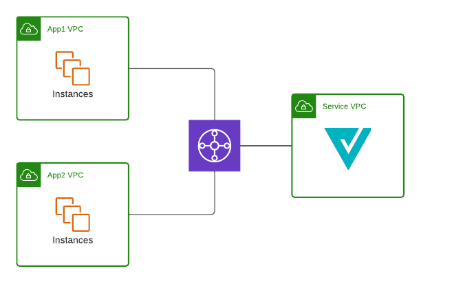
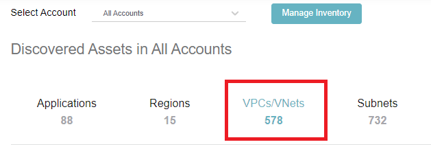
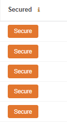

# Lab 2: Deploy

In Lab 1, the enablement of Valtix’s discovery features provided an inventory of the account and what traffic type was in the network. In a single click, you can see if any instances are potentially connecting to malicious destination.  In this lab, we will secure the network by deploying a Service VPC with Valtix Gateway in a hub-n-spoke model. Below is what we will achieve after this lab.



## Procedure

1. Navigate to **Easy Setup -> Service VPC**.
2. Fill in all the information:

     Parameter | Description
     ----------|-------------
     Name| Provide a name for Service VPC
     CSP Account| Select the account that was onboarded in Lab1.
     Region| Select the region where you deployed your CFT. 
     CIDR Block| Provide any /16 subnet. Example 10.100.0.0/16
     Availability Zones|Recommended that you select two AZ for redundancy.
     Transit Gateway| Select “create-new”
     Transit Gateway Name|  Provide a name for Transit Gateway. Example valtix-workshop-tgw.
     Auto Accept shared attachments| Leave it unchecked.
     Use NAT Gateway| Leave it unchecked.

3. Click on **Save & Continue**. This process may take 5 minutes. During this time, please do not navigate to a different link.
4. After completing the deployment of Service VPC, you should be taken to Create Gateway page where Valtix will orchestrate the deployment of Valtix Gateway in the Service VPC that was created.
5. Fill in the information to create Valtix Gateway:

     Parameter | Description
     ---------|-------------
     Account| Select the account that was onboarded in Lab1.
     Service VPC| Select the Service VPC that was created in step 4.
     Valtix Gateways| Check only “East-West & Egress”.
     East-West & Egress Gateway Name| Provide a name for the East-West & Egress Gateway. Example: aws-workshop-gw.
     East-West & Egress Gateway Policy Ruleset| Leave it as default, which is valtix-sample-egress-policy-ruleset.
     Gateway IAM Role Name| This value is from the CFT Outputs, use the value of "ValtixFirewallRoleName" (e.g valtix-firewall-role)
     SSH Key Pair| Select any ssh key pair that you want to use. 
     
6. Click **Save & Continue**
7. You will be landed on the inventory page(**Manage -> Cloud Accounts -> Inventory**). Click on VPCs/VNets. 

8. A list of all the VPCs in your account is shown here. This table will indicate whether the VPC is secured by Valtix. Find the spoke VPC that was deployed in the pre-requisite section.
9. Click on Secure button and select the Service VPC that was created in step 3.<br>
 <br>
10. Checkbox the all route table entries in the Route Table section. This will change the subnet route table to point to Transit Gateway. <br>
**Note:** After changing the default route, you may lose connection to the sample ec2 instance. Reconnect to your sample ec2 instance.
<br><br>

## Verification 

1. Navigate to **Manage -> Gateways -> Service VPCs**
2. Verify the Service VPC exist in the table. Check that the State is **ACTIVE**
3. Navigate to **Manage -> Gateways -> Gateways**.
4. Check the Gateway is shown in the table and that status is **ACTIVE**.
5. From the EC2 instance, generate traffic to Google and Facebook.

    ```
    curl http://www.google.com
    curl http://www.facebook.com
    ```
    
6. Navigate to **Investigate -> Flow Analytics -> Traffic Summary**. This gives an overview of traffic inspected by Valtix Gateway.
7. Click on Logs. You should see your sessions to Google and Facebook in the Logs table.

